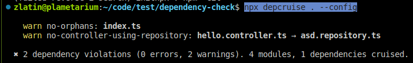

# Books and resources for new developers

The goal of this list isn't to teach a person how to program.

It is to help you move away from being a coder/hacker and start being a developer or engineer.

Each book is carefully selected. There aren't any books for absolute beginners or reference-type books like Code Complete.

Most books should be read several times. I still find new meaning behind the words when I reread them.

**The Pragmatic Programmer**

Contains a great overview of how your work isn't just coding. You should develop solutions and use automation as much as possible. It also focuses on core development principles like test driven development, CI/CD and short feedback loops.

.png>)

**The Clean series by Robert C. Martin**, Clean Code, Clean Architecture, etc.

Each book contains a lot of practical knowedge. The ideas aren't new per se nor are only in this book, but Bob Martin's writing is great and the books are battle tested.

.png>)

**Domain Driven Design**

This books will start your lifelong journey with practicing the fundamental skills of software design.

How do we form the data structures in our system ? How do we relate them ? What about the actions ?&#x20;

The sooner you read it the better.

****

**Design Patterns: Elements of Reusable Object-Oriented SoftwareThere is a great book**

.png>)

Design patterns build on top of the SOLID principles to help you write more maintainable code by offering battle tested solutions to generic and well understood problems.

As tempting as it is to rediscover the wheel the sooner a developer shackes off this feeling the better it is for them.
