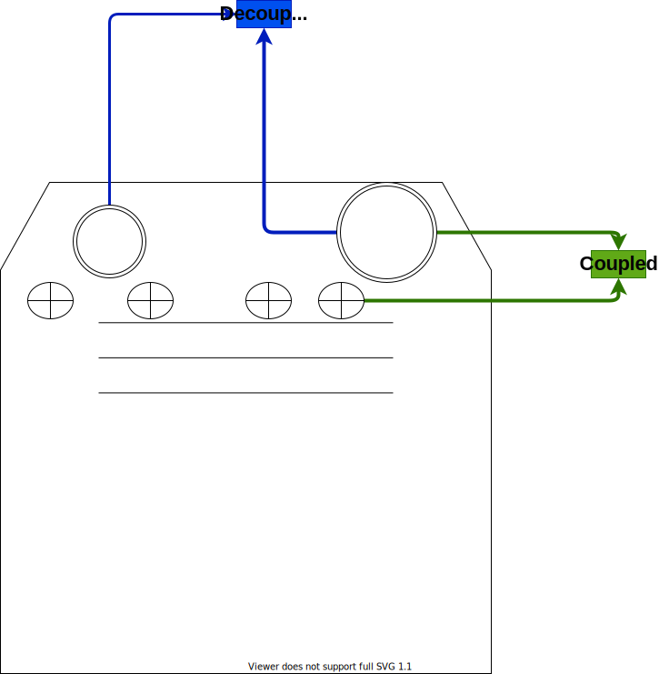
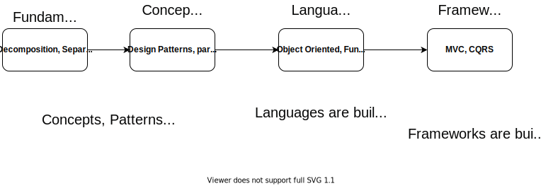

# Software Development Fundament

What are the fundamental principles and skills of software development ?

What are those things that are technology agnostic ?&#x20;

The things that remain when you switch frameworks or programming languages ?

💡 If you had **asked me this question a few years ago** I'd say that things like **logging**, **error handling** , **variable naming and domain knowledge** are the technology agnostic skills.

I will now disprove that statement.

.png>)

The domain knowledge is the easiest one to disprove. Yes, domain knowledge is great, but it is lost if you switch your domain. If you are an amazing web developer you are still going to struggle with embedded development. (and vice versa).

&#x20;Logging, error handling and variable naming are **core to programming**, however I still think they are 🚫 **not** 🚫 **part of the fundamental skills**.

💡 **Don't get me wrong - those are core skills you need to practice and be great at them.** You can't be a great developer if your error handling is poor or if your log messages are unreadable.

The reason why I think they are core but not fundamental is simple - they aren't applicable to the full process of software development.

Let's take CI/CD pipelines. They are a part of any adequate software development process. When you write the CI/CD pipelines the technologies we use are significantly simpler than the standard software development. For starters you don't need to worry about error handling. Each pipeline execution is done on a fresh agent, therefore when something goes wrong you simply stop execution. Logging is also mostly solved by the tools since they automatically log each job, it's status, visualize their progress, etc.

Here is an example for a Github Action that automatically nicely displays the steps:

.png>)

And also nicely logs each step:

.png>)

We have determined that these core skills for programming aren't applicable for release engineering. Since both of programming and release engineering are part of software development they **aren't fundamental**.

What are the fundamental principles then ?

📢 The goal of software development is to solve a problem. Even computer games solve the "problem" of entertainment, or lack thereof.

⚛️ So a problem exists and the solution is a software system.

**Requirements** are sparse if any. You **can't build** a successful solution **based on assumptions.**

📌 So you **decompose.** You decompose to understand the requirements and the system components. You can decompose on different levels of granularity. You don't decompose by features. Features are built by integrating system parts.

📌 Once you have identified the different parts of your system you need to separate their concerns. Why does part X exist ? **What is it's responsibility ?** What is not it's responsibility ?

📌 When this is done you need to couple strongly parts of the software that should go together and weakly **couple** the parts which don't have that much in common.

Let's take an example with something from the real world. A stove ♨️.&#x20;

A Stove exists because people need nourishment. There are different solutions - order food online, eat raw food or cook your food. The stove solves the problem by offering the feature of cooking.

Let's decompose the stove. It requires an energy source. And it has heat sources that are used for cooking. It has dials that control the heat sources.

Let's decompose the energy source. It can be electricity or gas. We can decompose further if needed.

The decomposition of the heat sources is:

* stove tops
* oven

An oven may have a ventilator and lamp. Both ovens and stove tops are controlled by dials

Now for separation of concerns:

* the only job of the energy source is to feed the stove tops and ovens
* the job of the stove top and oven is only to generate and maintain a certain amount of heat.

And finally the coupling:

* the oven and stove top are loosely coupled.
* the oven and oven fan are strongly coupled
* the burners on the stove top are loosely coupled. You can use any or all of them at the same time.

The example perhaps is a bit banal but I think it get's the point across.

<figure><figcaption></figcaption></figure>

So far we have derived that the fundamental principles of software development are:

* Decomposition
* Separation of Concerns
* Coupling

🤔 **How is this applied to programming ?** What are the rules for Decomposition/SoC/Coupling ? How do I know if something is decomposed properly or not ?

There is a lot of small bits of guidance scattered around a lot of books. But if it is so fundamental there surely must be something common, right ? Something well know ?

😊 You are absolutely right there is!

It's the **SOLID principles**. They are the most common rule set we have that deals exactly with these 3 fundamental principles.&#x20;

💡 Note: you can find principles that help us shape the fundamentals scattered around all aspects of software development, for example the Normal Forms for relational databases.

Built on top of solid are the **design patterns** (not just the original ones) that offer solutions to specific problems.

One level above that are the **programming languages** - every programming language is built on top of several core design principles. (like OOP, functional, procedural)

One level above the programming language are the **frameworks** - they use a subset of the language in a specific domain and are based on several design patterns that are used throught the framework.

<figure><figcaption></figcaption></figure>

The fundamental skills for software development affect all areas - programming, devops, architecture, QA, etc.

Perhaps deep knowledge in these areas is the mark of a great developer.&#x20;

Perhaps that is why a lot of developers end up transitioning much easier to architecture positions than into management.

Or maybe I'm wrong altogether. Thoughts ?
