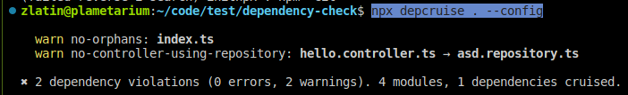

# Validating code Architecture with dependency cruiser

We are going to use [dependency cruiser](https://github.com/sverweij/dependency-cruiser).

In this short tutorial we are going to create a custom rule that makes sure that your controller files cannot import your repositories. The rules can be a lot more ellaborate. The idea is to showcase that it is easy and that it doesn’t need to take a lot of time to get the automatic checks going.

Create an npm project, install ts-node, dependency cruiser, etc.

Then, initialize our dependencies:

`npx depcruise --init`&#x20;

`npx tsc --init`

We are going to create two files `asd.repository.ts` and `hello.controller.ts`.

Create our test files. They should be in the root directory.

`//asd.repository.ts`&#x20;

`function asd() { return 12; }`&#x20;

`export default asd;`

&#x20;

Create our test files. They should be in the root directory.

`//hello.controller.ts`&#x20;

`import asd from "./asd.repository";`&#x20;

`asd();`

&#x20;

In our scenario `hello.controller.ts` violates our architecture rules! Controllers must not use repositories directly. So how can we write a rule that fixes it ?

We need to edit the dependency-cruiser configuration file. It is already generated and should be in the root level of your project: `.dependency-cruiser.js`

We need to edit the **rules** array inside and add a new object.

The object we are going to add is:

`{ name: "no-controller-using-repository", from: { path: "controller" }, to: { path: "repository" }, },`

… And that is all there is to it! Now any file containing repository in it’s name can’t be used by a file containing controller in it’s name.

Let’s test it out:

`npx depcruise . --config`

Will produce the following output:

As you see there is one more error in my local repository&#x20;

You can experiment with the rules and automate a decent chunk of the code architecture.

The only prerequisite is to have consistent file names.

[Example repo](https://github.com/Sprinting-Software/architecture-validation-primer)

Good luck!
